# App.Java
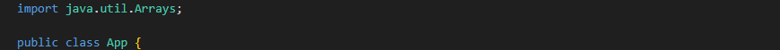
importamos arrays para poder copiar arreglos y asi evitar destruir de manera constante el arreglo original al momento de probvar varios metodos, haciendo que tecnicamente sea infinito hasta que el usuario decida salir
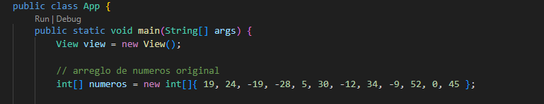
Creamos el objeto view que nos ayudara pues funcionara como interface y mostrara los diferentes menus y opciones del programa

Tambien inicializamos el areglos con el que nuestro programa va a probar cada metodo de ordenamiento

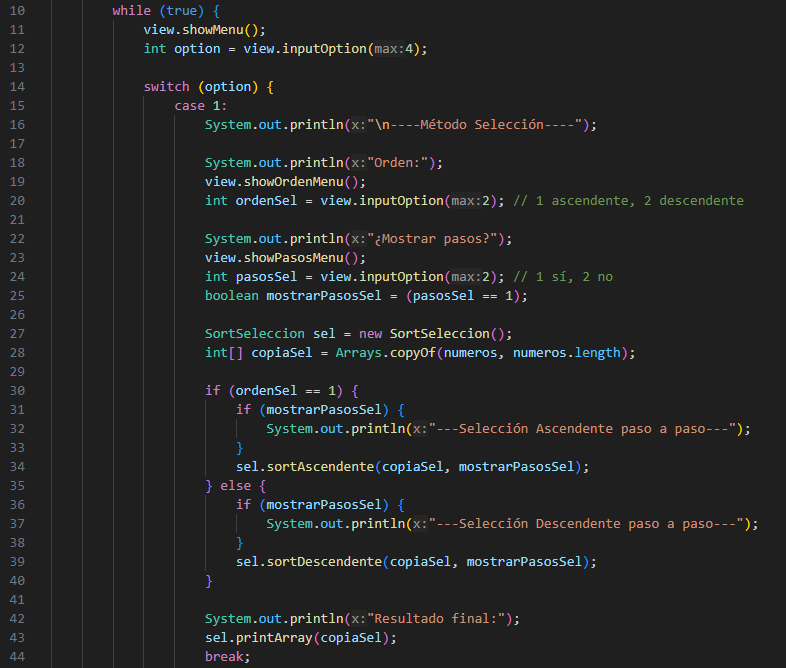
Un bucle infinito que no terminara hasta que el usuari decida selecionar la salida

Tambien ahi mostraresmo el menu

y pediremos al usario que ingrese un valor del una al 4 (el codigo de esto esta en la clase view)

de ahi iniciamos con el switch

el switch es una estructura de control de flujo que permite ejecutar diferentes bloques de codigo basandose en el valor de una variable (en este caso la variable opcion)

Le preguntaresmos al usuario que desea si aqsecndenete o desendente y si quiere ver el proceso

*OjO:* una vez inicializada culaquiera de las opciones nos toca guardar una copia del arreglo original, por si desea volver a usar el areglo original con otra de las opciones

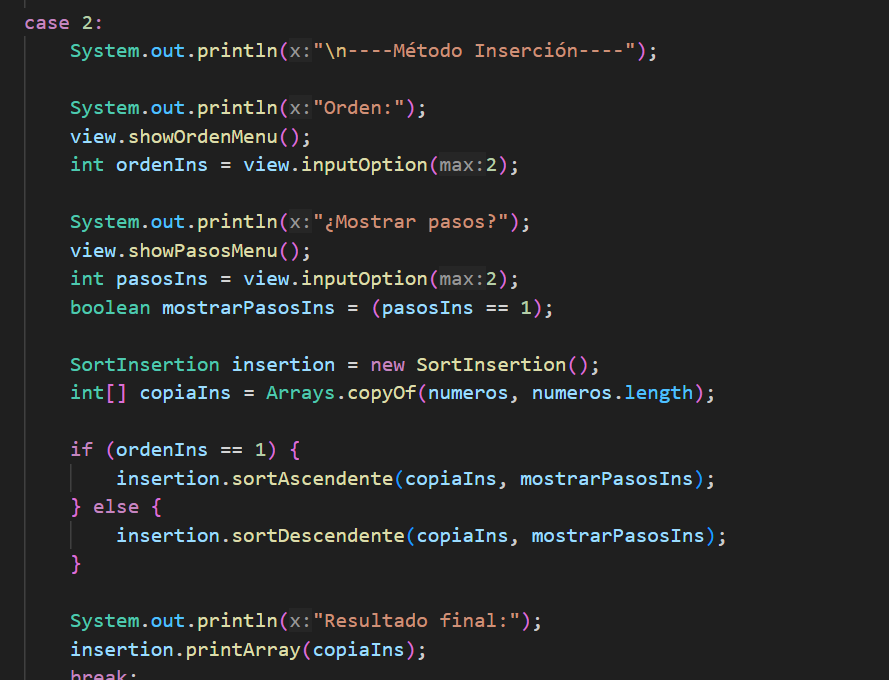 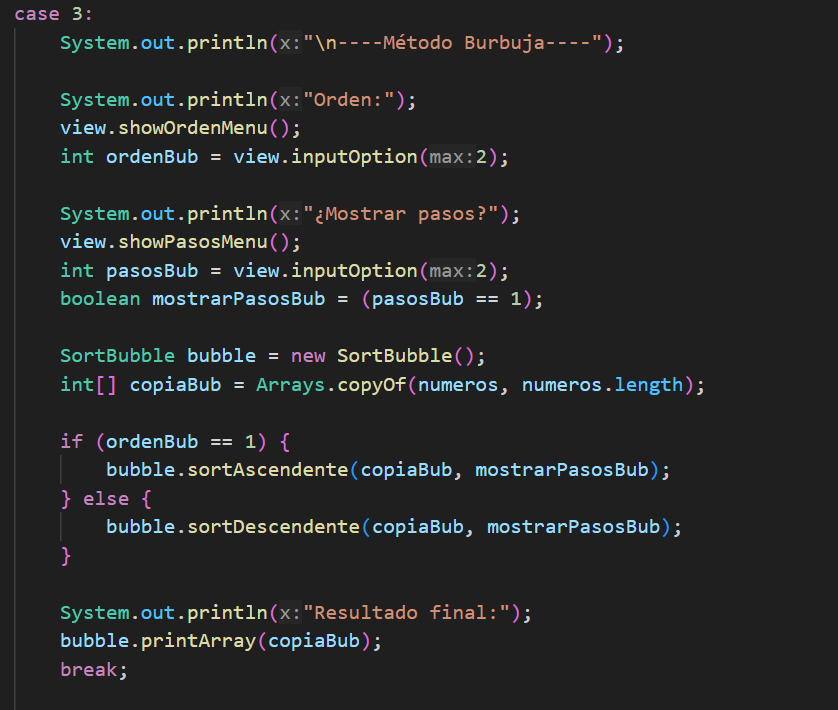
Es similar para los demas casos

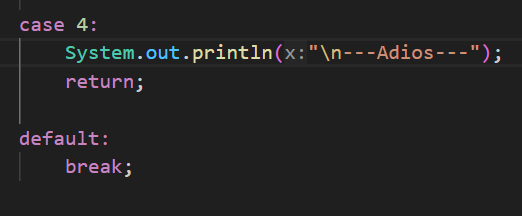
La ultima opcion termina el programa

# View
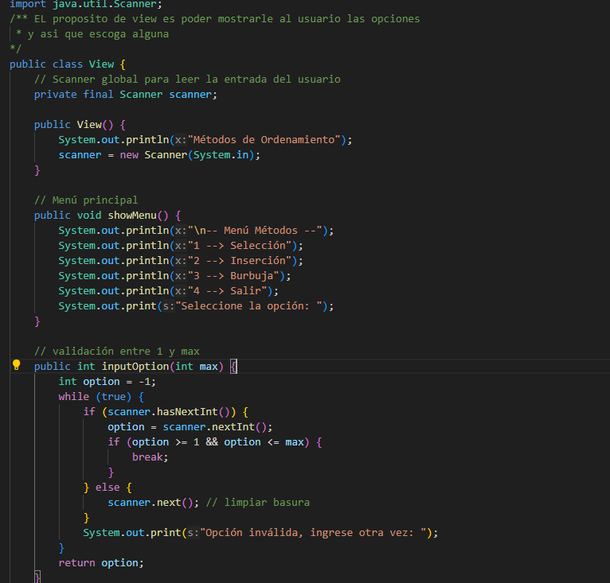
Scanner nos permite leer desde la consola, principalmente la entrada del usuario a través de la consola o archivos de texto

De ahi mostramos el menu principal con las opciones del algoritmo

nos aseguramos que las opciones solo pueda meter opciones validas entre 1 y un maximo para evitar qeu pongan letrras fuera de rango y o letras

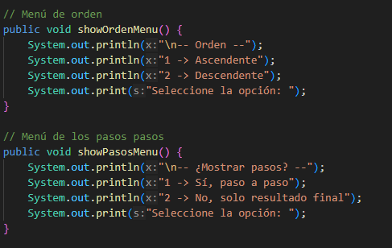
aquiu le mostramos si desea que sea ascendente o desendente y si desea que se muestre el proceso

# SortBubble
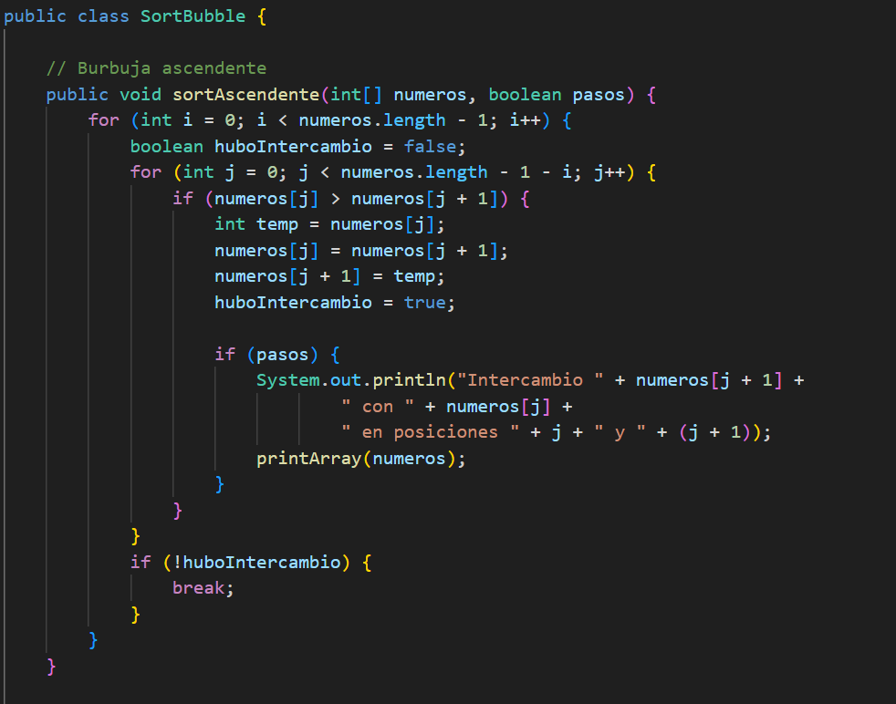
*Burbble:*Es un algoritmo sencillo de ordenación que compara repetidamente elementos adyacentes de un arreglo y los intercambia si están en el orden incorrecto. Se repite el proceso hasta que una pasada completa no requiera ningún intercambio, lo que indica que el arreglo está ordenado.

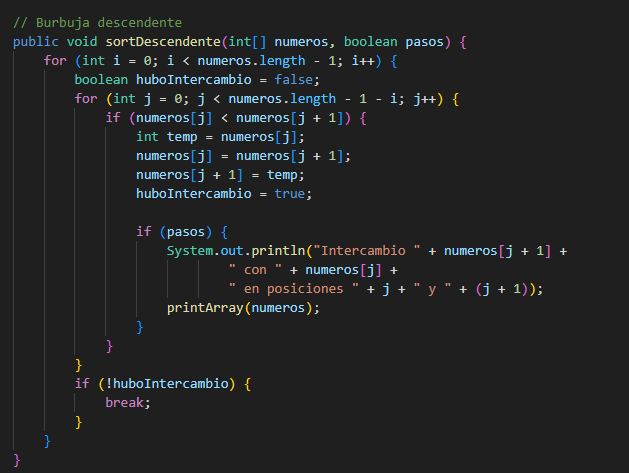
Esta es la version desendentte de el Burbble

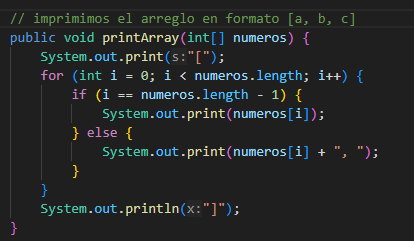

Aqui imprimimos el areglos ya listo

# SortInsertion
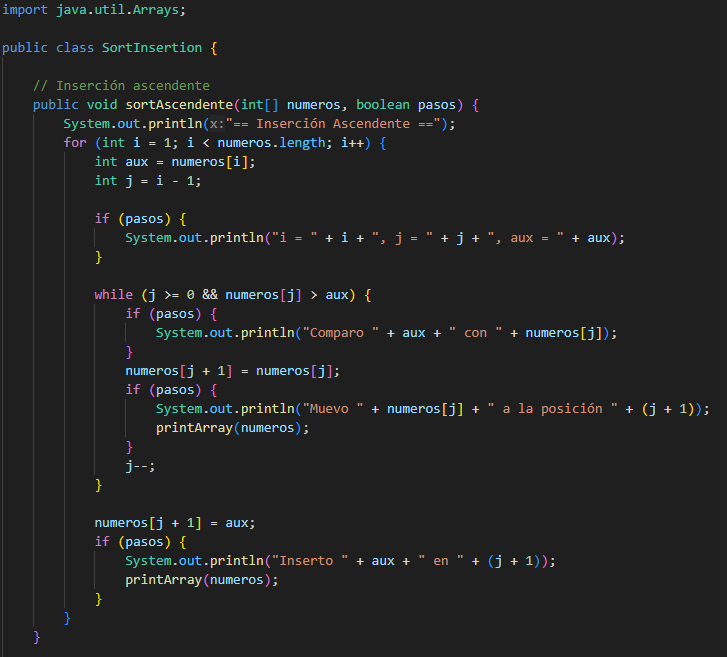
*Insertion:* Es un algoritmo de ordenación que construye el arreglo final ordenado un elemento a la vez. Funciona dividiendo el arreglo en una parte ordenada y otra desordenada, y va tomando elementos de la parte desordenada para insertarlos en su posición correcta dentro de la parte ordenada

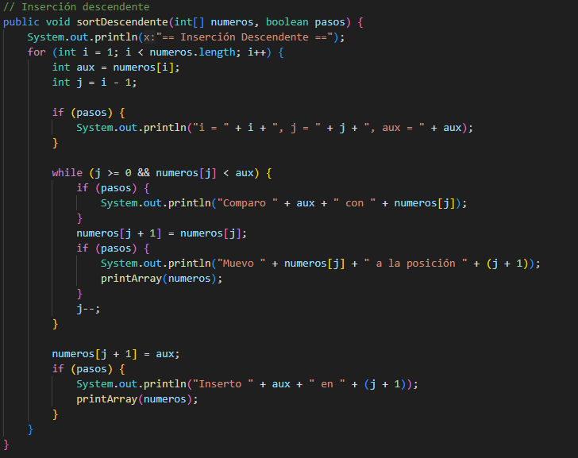
La version desendiente del metodo

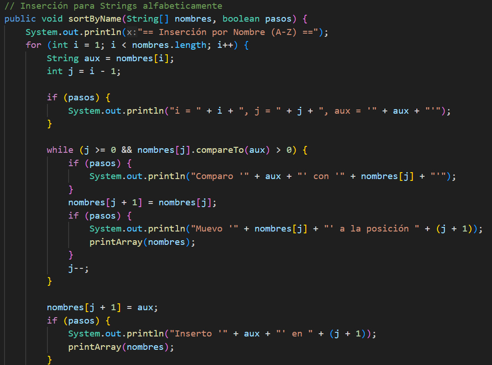
usamos el compareTo() para hacer la insercion con texto, en el codigo aun quedan remanencias de esto, se deja para demostrar/presumir los conocimientos del autor pero no afecta en nada al codigo

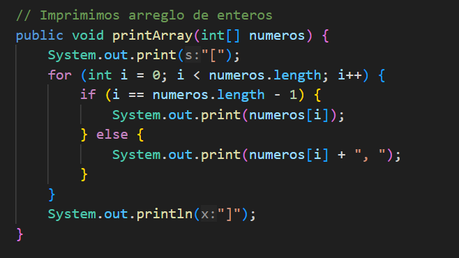
aqui imprimimos el arreglo

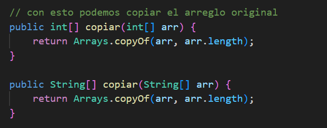
Aqui hacemos la copia del areglo
# SortSeleccion
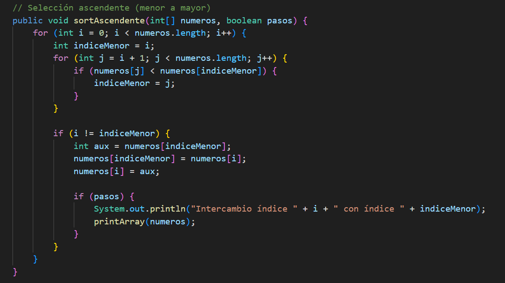
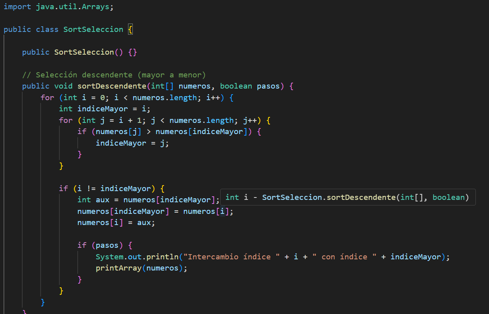
*Select:* es un algoritmo de ordenamiento que divide el arreglo en dos partes: una ordenada y otra no ordenada. En cada iteración, encuentra el elemento más pequeño en la parte no ordenada y lo intercambia con el primer elemento de esa sección, expandiendo así la parte ordenada

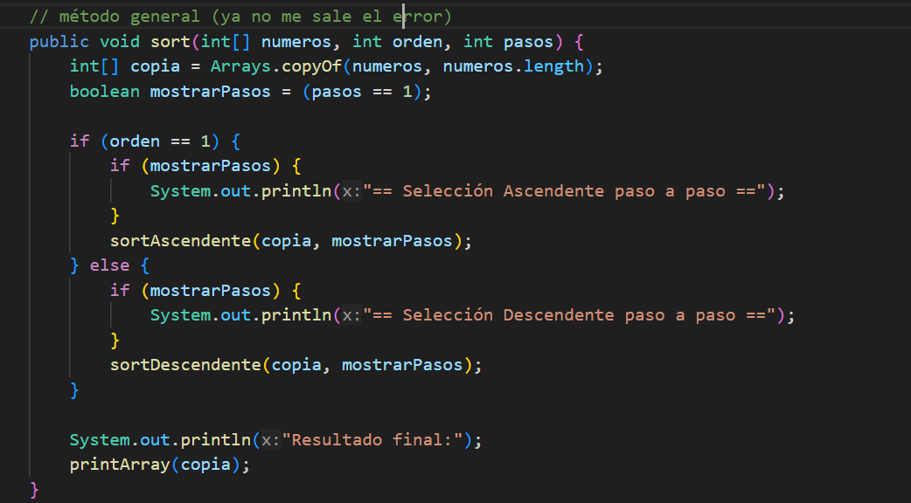
esta parte es para mostrar el sout del resultado del paso a paso y el resultado final